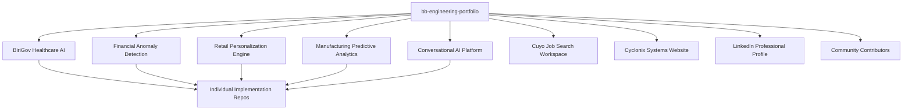

# Product Requirements Document: BB Engineering Portfolio

**AI/ML Reference Implementation Portfolio Showcase & Documentation Hub**

---

## Document Metadata

| Field | Value |
|-------|-------|
| **Project Name** | BB Engineering Portfolio - Showcase & Documentation Hub |
| **Project Code** | BB-PORTFOLIO-HUB |
| **Version** | 1.0 |
| **Created Date** | 2025-09-04 |
| **Document Owner** | Brian Boelsterli |
| **Product Type** | Portfolio Showcase Platform & Documentation Hub |
| **Target Audience** | Developers, Technical Leaders, Enterprise Executives, Open Source Contributors |

---

## Executive Summary

### Product Vision
Transform the bb-engineering-portfolio repository into the definitive showcase and documentation hub for enterprise-grade AI/ML reference implementations, demonstrating strategic technical leadership through accessible, working code that solves real business problems.

### Business Objective
Create a professional portfolio platform that bridges the gap between AI strategy and implementation by providing:
- **Strategic Credibility**: Executive positioning with demonstrable hands-on technical expertise
- **Developer Value**: Accessible, working implementations with comprehensive documentation
- **Commercial Impact**: Sales engineering tools and reference architectures for client conversations
- **Community Growth**: Open-source collaboration framework with proper contributor recognition

### Key Success Metrics
- **Professional Impact**: 100+ LinkedIn profile views from technical executives per month
- **Developer Adoption**: 50+ successful repository clones and local setups monthly
- **Community Engagement**: 10+ active contributors across the 5 AI pattern implementations
- **Business Value**: 5+ client conversations directly supported by portfolio demonstrations
- **Technical Quality**: 100% of implementations meeting enterprise-grade quality standards

### Investment Overview
- **Development Effort**: 40 hours (portfolio hub development and documentation)
- **Infrastructure Costs**: $0 (GitHub hosting, no additional cloud infrastructure)
- **Maintenance**: 2-4 hours monthly (community management, documentation updates)
- **Timeline**: 4 weeks (parallel to BiriGov development)

---

## Strategic Context

### Business Problem Statement
**Primary Challenge**: Technical executives often lack demonstrable hands-on implementation expertise to complement their strategic leadership experience, creating a credibility gap in AI transformation conversations.

**Market Gap**: Most AI "portfolios" are either toy examples or proprietary implementations that can't be accessed, studied, or verified by the technical community.

**Solution Opportunity**: Create a transparent, accessible showcase of real enterprise-grade AI implementations with comprehensive documentation that serves multiple audiences simultaneously.

### Market Opportunity
- **AI Skills Shortage**: 73% of enterprises struggle to find technical leaders who can both strategize AND implement AI solutions
- **Developer Education Gap**: Lack of accessible, enterprise-grade AI implementation examples
- **Consulting Market**: $50B+ enterprise AI transformation market seeking proven implementation capabilities
- **Open Source Growth**: Increasing demand for reference architectures and proven patterns

### Strategic Alignment
**Career Advancement**: Directly supports Field CTO, Chief AI Officer, VP AI opportunity positioning through demonstrated technical capability.

**Commercial Value**: Enables Cyclonix Systems positioning as "we've built this" versus "we can build this" in client conversations.

**Community Impact**: Establishes thought leadership in enterprise AI implementation space through practical contribution.

---

## Product Scope & Requirements

### In Scope - Core Product Features

#### 1. **Strategic Portfolio Showcase**
- Professional README with executive positioning
- Clear articulation of 5 fundamental AI patterns
- Business impact metrics and industry applicability
- Technology stack demonstrations and architecture decisions

#### 2. **Developer-First Documentation Hub**
- Comprehensive setup guides for each implementation
- One-command installation and demo execution
- Progressive learning path: Overview → Details → Demo → Clone & Run
- Troubleshooting guides and common issue resolution

#### 3. **Community Collaboration Framework**  
- Contributor onboarding and recognition system
- Clear attribution model balancing executive positioning with contributor credit
- GitHub issue templates and workflow automation
- Open source collaboration guidelines and code of conduct

#### 4. **Security & Legal Framework**
- Comprehensive security guidelines and best practices
- Legal protection through appropriate disclaimers and licensing
- Cost management and operational sustainability guidelines
- Compliance considerations for enterprise adoption

#### 5. **Business Value Demonstration**
- Clear ROI analysis and business case documentation for each pattern
- Industry-specific use cases and applicability guidance
- Executive conversation support materials
- Success metrics and impact measurement frameworks

### Out of Scope - Phase 1

#### **Web Interface Development**
- Custom web UI beyond GitHub's native rendering (future enhancement)
- Complex interactive demonstrations beyond command-line and recordings
- User authentication or personalization features

#### **Advanced Analytics**  
- Detailed usage tracking beyond GitHub's native analytics
- Advanced community management tools beyond GitHub's capabilities
- Custom notification or alert systems

#### **Production Services**
- Hosted demonstration environments (implementations handle their own deployment)
- Commercial support or SLA guarantees
- Enterprise-specific customization services

### Assumptions
- **GitHub Platform**: GitHub remains the primary collaboration and showcase platform
- **Community Growth**: Developer community will organically engage with quality implementations
- **Parallel Development**: Individual AI pattern implementations (like BiriGov) developed separately
- **Maintenance Model**: Community-driven maintenance with maintainer oversight

### Constraints
- **Time Investment**: Maximum 40 hours for initial hub development
- **Cost Limitation**: $0 additional infrastructure costs (GitHub hosting only)
- **Maintenance Sustainability**: Must be maintainable by single person with community support
- **Quality Standards**: All documentation must meet enterprise professional standards

---

## User Stories & Requirements

### Primary User: Enterprise Developers

#### **User Story 1: Quick Implementation Access**
**As an enterprise developer**, I want to quickly clone and run working AI implementations so that I can learn enterprise patterns without months of research.

**Acceptance Criteria:**
- [ ] One-command setup for each implementation repository
- [ ] Clear system requirements and dependency management
- [ ] Working demonstrations with synthetic data included
- [ ] Comprehensive troubleshooting documentation

#### **User Story 2: Learning Progressive Complexity**
**As a developer learning enterprise AI**, I want to progress from high-level concepts to hands-on implementation so that I can build practical expertise systematically.

**Acceptance Criteria:**
- [ ] Clear progression path from overview to implementation details
- [ ] Business context explanation for each technical decision
- [ ] Code comments and documentation explaining enterprise considerations
- [ ] Reference links to deeper learning resources

### Primary User: Technical Leaders

#### **User Story 3: Reference Architecture Guidance**
**As a technical leader**, I want proven reference architectures for AI implementations so that I can guide my team's technical decisions with confidence.

**Acceptance Criteria:**
- [ ] Clear architecture documentation for each implementation
- [ ] Technology stack justification and alternatives discussion
- [ ] Scalability considerations and enterprise deployment guidance
- [ ] Security and compliance framework documentation

#### **User Story 4: Team Education Resources**
**As an engineering manager**, I want comprehensive learning resources so that I can accelerate my team's AI implementation capabilities.

**Acceptance Criteria:**
- [ ] Team onboarding guides and learning paths
- [ ] Workshop-style documentation for team training
- [ ] Discussion of common pitfalls and lessons learned
- [ ] Contribution opportunities for team skill building

### Primary User: Enterprise Executives

#### **User Story 5: Strategic Validation**  
**As an enterprise executive**, I want to see concrete examples of AI business value so that I can make informed investment decisions.

**Acceptance Criteria:**
- [ ] Clear business case documentation for each pattern
- [ ] ROI analysis and industry applicability
- [ ] Risk assessment and mitigation strategies
- [ ] Implementation timeline and resource requirement guidance

#### **User Story 6: Vendor Capability Assessment**
**As a potential client**, I want to evaluate technical implementation capabilities so that I can assess consulting partnership opportunities.

**Acceptance Criteria:**
- [ ] Transparent demonstration of technical depth
- [ ] Clear evidence of enterprise-grade development practices
- [ ] Professional positioning and experience articulation
- [ ] Contact information and collaboration opportunities

### Secondary User: Open Source Contributors

#### **User Story 7: Contribution Opportunity**
**As an open source contributor**, I want clear guidance on how to contribute so that I can gain recognition while supporting valuable implementations.

**Acceptance Criteria:**
- [ ] Comprehensive contributing guidelines
- [ ] Clear attribution and recognition model
- [ ] Technical standards and quality expectations
- [ ] Onboarding process and mentorship opportunities

---

## Technical Architecture

### Platform Architecture
```
bb-engineering-portfolio (GitHub Repository)
├── README.md (Primary showcase and navigation)
├── CONTRIBUTING.md (Community collaboration framework)
├── SECURITY.md (Security guidelines and best practices)
├── LICENSE (MIT with additional terms)
├── docs/
│   ├── ARCHITECTURE.md (Technical architecture overview)
│   ├── BUSINESS_CASE.md (ROI analysis and value proposition)
│   └── PATTERNS/ (Individual pattern deep-dives)
├── .github/
│   ├── ISSUE_TEMPLATE/ (Contributor onboarding templates)
│   ├── workflows/ (CI/CD for documentation quality)
│   └── PULL_REQUEST_TEMPLATE.md
└── assets/
    ├── diagrams/ (Architecture and flow diagrams)
    └── demos/ (Screenshots and recordings)
```

### Technology Stack
- **Documentation Platform**: GitHub Markdown with enhanced formatting
- **Version Control**: Git with conventional commit standards
- **CI/CD**: GitHub Actions for documentation quality assurance
- **Community Management**: GitHub Issues, Discussions, and Projects
- **Visual Assets**: Mermaid diagrams, screenshots, and demo recordings

### Integration Architecture


### Quality Assurance Framework
- **Documentation Standards**: Automated spell-check, link validation, and formatting consistency
- **Content Review**: Peer review process for major content changes
- **Community Feedback**: GitHub Discussions for community input on improvements
- **Performance Monitoring**: GitHub Analytics for engagement and usage patterns

---

## Implementation Strategy

### Development Approach: **Documentation-Driven Development (DDD)**

#### **Phase 1: Foundation (Week 1)**
- **Strategic Documentation**: Complete README transformation with professional positioning
- **Legal Framework**: Comprehensive licensing, disclaimers, and security guidelines  
- **Community Framework**: Contributing guidelines and recognition model
- **Quality Baseline**: Documentation standards and automated validation

**Deliverables:**
- [ ] Professional README with strategic positioning
- [ ] Complete legal and security framework
- [ ] Community collaboration guidelines
- [ ] Documentation quality automation

#### **Phase 2: Content Development (Week 2-3)**
- **Business Case Documentation**: ROI analysis and value proposition for each AI pattern
- **Technical Architecture**: Deep-dive documentation for each implementation approach
- **Developer Resources**: Comprehensive setup guides and troubleshooting documentation
- **Visual Assets**: Architecture diagrams, screenshots, and demo recordings

**Deliverables:**
- [ ] Comprehensive business case documentation
- [ ] Technical architecture deep-dives
- [ ] Developer onboarding resources
- [ ] Visual and demo assets

#### **Phase 3: Community Activation (Week 4)**
- **Contributor Onboarding**: Streamlined process for community engagement
- **Content Promotion**: Strategic sharing across professional networks
- **Feedback Integration**: Community input incorporation and iteration
- **Launch Preparation**: Final quality review and launch coordination

**Deliverables:**
- [ ] Active contributor onboarding process
- [ ] Professional network engagement
- [ ] Community feedback integration
- [ ] Launch-ready portfolio platform

### Team Structure & Responsibilities

#### **Primary Role: Product Owner & Technical Writer**
- **Responsibility**: Overall vision, strategic positioning, content quality
- **Time Commitment**: 30-35 hours over 4 weeks
- **Key Skills**: Technical writing, strategic communication, community management

#### **Community Contributors (As Available)**
- **Responsibility**: Content review, feedback, specific expertise contributions
- **Recognition**: Attribution in documentation and contributor profiles
- **Engagement**: Voluntary basis with clear contribution guidelines

### Quality Gates & Success Criteria

#### **Quality Gate 1: Professional Positioning**
- **Criteria**: README effectively communicates executive technical leadership
- **Validation**: Review by technical executives and potential collaborators
- **Success Metric**: Clear differentiation from typical developer portfolios

#### **Quality Gate 2: Developer Accessibility**  
- **Criteria**: Developers can successfully navigate and understand implementation paths
- **Validation**: Developer feedback and setup success rate tracking
- **Success Metric**: 90%+ successful navigation through documentation

#### **Quality Gate 3: Community Engagement**
- **Criteria**: Contributors understand how to engage and receive recognition
- **Validation**: Successful contributor onboarding and attribution model
- **Success Metric**: 5+ community contributors within first month

---

## Success Metrics & KPIs

### Business Impact Metrics

#### **Strategic Career Value**
- **Executive Profile Views**: 100+ LinkedIn profile views from senior technical roles monthly
- **Consultation Inquiries**: 3+ strategic technology leadership conversation requests monthly
- **Professional Recognition**: Speaking opportunities, interview requests, industry recognition

#### **Commercial Value (Cyclonix Systems)**
- **Client Conversations**: 5+ client engagements directly supported by portfolio demonstrations
- **Sales Engineering**: Portfolio used in 80%+ of technical capability discussions
- **Thought Leadership**: Regular content publication and industry engagement opportunities

### Community & Developer Metrics

#### **Developer Adoption**
- **Repository Engagement**: 100+ stars, 50+ forks across portfolio repositories
- **Setup Success Rate**: 90%+ successful one-command setup completion
- **Documentation Usage**: 500+ monthly page views on technical documentation

#### **Community Growth**
- **Active Contributors**: 10+ contributors across implementation repositories
- **Community Discussions**: 20+ monthly GitHub discussions and issue interactions
- **Knowledge Sharing**: Regular community contributions and improvements

### Technical Quality Metrics

#### **Documentation Quality**
- **Content Accuracy**: 100% of links functional, 0 spelling/grammar errors
- **Technical Completeness**: All implementations have comprehensive setup and demo documentation
- **Professional Standards**: All content meets enterprise-grade communication standards

#### **Platform Performance**
- **Load Performance**: GitHub repository loads within 2 seconds
- **Search Optimization**: Top 5 results for "enterprise AI reference implementation" searches
- **Mobile Accessibility**: Full functionality on mobile devices

---

## Risk Management

### High-Risk Factors

#### **Risk 1: Community Contributor Management**
- **Impact**: Contributor quality or community management overhead
- **Probability**: Medium
- **Mitigation Strategy**: Clear contributor guidelines, automated quality checks, community moderators
- **Contingency Plan**: Temporarily restrict contributions to maintain quality standards

#### **Risk 2: Professional Positioning Dilution**  
- **Impact**: Executive credibility undermined by community contributions or content quality
- **Probability**: Low
- **Mitigation Strategy**: Final review authority on all strategic content, clear voice and tone guidelines
- **Contingency Plan**: Maintain separate "official" branch with controlled content updates

### Medium-Risk Factors

#### **Risk 3: Maintenance Overhead**
- **Impact**: Unsustainable time commitment for content maintenance and community management
- **Probability**: Medium  
- **Mitigation Strategy**: Community-driven maintenance model, automated quality checks
- **Contingency Plan**: Reduce scope to core implementations, archive non-essential content

#### **Risk 4: Implementation Repository Dependencies**
- **Impact**: Individual implementation repositories not meeting quality or timeline expectations
- **Probability**: Medium
- **Mitigation Strategy**: Portfolio hub independence from implementation timeline, clear status communication
- **Contingency Plan**: Adjust timeline expectations, focus on completed implementations

### Low-Risk Factors

#### **Risk 5: Technology Platform Changes**
- **Impact**: GitHub changes affecting portfolio presentation or functionality
- **Probability**: Low
- **Mitigation Strategy**: Platform-agnostic documentation approach, backup content storage
- **Contingency Plan**: Migration to alternative platform if necessary

---

## Resource Requirements & Budget

### Human Resources

#### **Development Phase (4 weeks)**
- **Product Owner/Technical Writer**: 35 hours
  - Week 1: 10 hours (Foundation)
  - Week 2: 10 hours (Content Development)
  - Week 3: 10 hours (Content Development)
  - Week 4: 5 hours (Community Activation)

#### **Ongoing Maintenance**
- **Monthly Time Commitment**: 2-4 hours
  - Community management: 1-2 hours
  - Content updates: 1-2 hours
  - Quality maintenance: 30 minutes

### Technology Costs

#### **Development Costs**
- **GitHub Repository**: $0 (public repository)
- **Development Tools**: $0 (using existing development environment)
- **Documentation Tools**: $0 (GitHub native markdown and tools)

#### **Ongoing Operational Costs**
- **Platform Hosting**: $0 (GitHub Pages if needed)
- **Domain/Branding**: $0 (using github.com/basilan URLs)
- **Monitoring/Analytics**: $0 (GitHub native analytics)

### Total Investment
- **Initial Development**: $0 out-of-pocket (time investment only)
- **Monthly Operational**: $0
- **Annual Total**: $0

---

## Launch Strategy & Go-To-Market

### Pre-Launch Phase

#### **Content Quality Assurance** 
- Comprehensive review of all documentation for accuracy and professionalism
- Technical validation of all setup guides and developer instructions
- Legal review of licensing and disclaimer language

#### **Community Preparation**
- Contributor onboarding process testing
- GitHub templates and automation configuration
- Initial outreach to potential early contributors

### Launch Phase

#### **Professional Network Activation**
- LinkedIn announcement with strategic messaging
- Direct outreach to relevant technical executives and potential collaborators
- Industry community engagement (relevant Slack channels, forums, etc.)

#### **Developer Community Engagement**
- Strategic sharing in relevant developer communities
- Open source project directories and showcases
- Technical blog post publication on announcement

#### **SEO & Discovery Optimization**
- Repository description optimization for discoverability
- README content optimization for search terms
- GitHub topic tags and categorization

### Post-Launch Growth

#### **Content Marketing Strategy**
- Regular updates and new pattern announcements
- Technical blog posts about implementation lessons learned
- Speaking opportunities and conference presentations

#### **Community Building**
- Active engagement with contributors and users
- Regular community events (virtual meetups, Q&A sessions)
- Collaboration opportunities with related open source projects

---

## Success Measurement & Iteration

### Success Validation Timeline

#### **30-Day Metrics**
- **Repository Engagement**: 50+ stars, 25+ forks
- **Community Response**: 5+ contributors showing interest
- **Professional Recognition**: 2+ strategic conversation requests
- **Developer Adoption**: 20+ successful implementation clones

#### **90-Day Metrics** 
- **Portfolio Maturity**: 3+ AI patterns with comprehensive documentation
- **Community Growth**: 10+ active contributors across implementations
- **Business Impact**: 3+ client conversations supported by portfolio
- **Industry Recognition**: Speaking opportunity or interview request

#### **180-Day Metrics**
- **Market Position**: Recognized as leading enterprise AI reference implementation resource
- **Commercial Success**: Regular use in Cyclonix Systems client conversations
- **Community Ecosystem**: Self-sustaining contributor community
- **Professional Impact**: Clear career advancement opportunities arising from portfolio

### Continuous Improvement Framework

#### **Monthly Review Process**
- Community feedback analysis and incorporation
- Documentation quality audit and improvements
- Contributor recognition and engagement review
- Strategic positioning assessment and adjustments

#### **Quarterly Strategic Review**
- Business impact assessment and metric evaluation
- Community growth analysis and engagement optimization
- Professional positioning effectiveness review
- Market opportunity identification and strategic pivots

---

## Conclusion & Next Steps

### Strategic Value Proposition
The BB Engineering Portfolio represents a unique opportunity to demonstrate the rare combination of strategic AI leadership vision with hands-on technical implementation expertise. This portfolio will serve as a comprehensive showcase, developer resource, and business development tool while building a sustainable open source community around enterprise AI implementation patterns.

### Immediate Action Items
1. **Finalize Foundation Documentation** (Week 1)
   - Complete README strategic positioning review
   - Implement community framework and legal protections
   - Set up documentation quality automation

2. **Develop Content Strategy** (Week 2-3)
   - Create comprehensive business case documentation
   - Develop technical architecture deep-dives
   - Build developer onboarding resources

3. **Launch Community Engagement** (Week 4)
   - Activate professional network outreach
   - Begin developer community engagement
   - Implement feedback collection and iteration process

### Long-Term Vision
Transform the BB Engineering Portfolio into the definitive resource for enterprise-grade AI implementation patterns, establishing thought leadership in the space while demonstrating practical technical expertise that directly supports career advancement and business development objectives.

**Success Definition**: When technical executives, enterprise developers, and business decision-makers consistently refer to this portfolio as a trusted source for understanding how to implement AI solutions that deliver real business value.

---

*This PRD serves as the strategic foundation for building a world-class AI/ML reference implementation portfolio that bridges the gap between strategy and execution in enterprise AI transformation.*